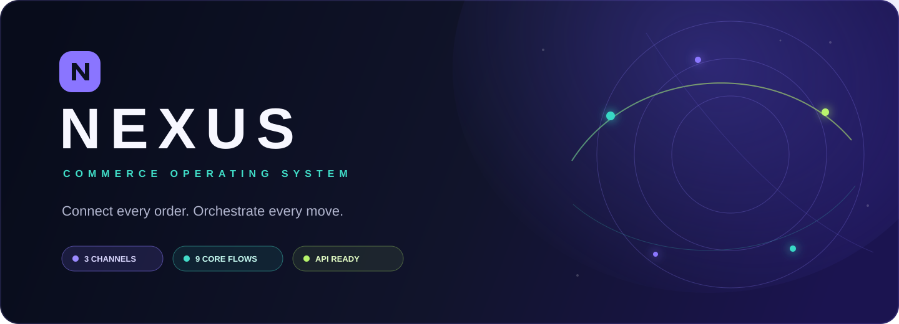
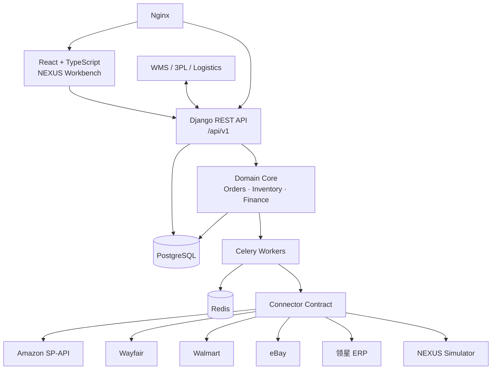

<div align="center">
  
</div>

<div align="center">

[](https://github.com/JimMinseay3/nexus-commerce-os/actions/workflows/ci.yml)


[](LICENSE)

### 把分散在全球渠道、仓库与表格里的业务，连接成一套可以运转的系统。

**NEXUS** 是面向跨境电商团队的中文 Commerce OS 与全渠道数据中台。它以自己的标准字段体系统一 Amazon、eBay、Wayfair、Walmart、领星 ERP 和 Excel/CSV 的商品、订单、仓储、采购、售后与经营财务；没有真实 API 凭证时，也能通过内置业务模拟器跑通完整闭环。

[快速开始](#-3-分钟启动) · [全链路沙盘](#-全链路业务沙盘) · [系统架构](#-系统架构) · [API 文档](docs/API_INTEGRATION.md) · [操作手册](docs/USER_GUIDE.md)

</div>

---

## 为什么是 NEXUS？

很多 ERP 能保存数据。NEXUS 更关注数据如何在业务事件中**可靠地流动**：订单重复同步不会重复扣库，出库完成后平台回传失败也不会撤销本地库存，退货质检会重新计算利润，补货建议能解释每一个数字从哪里来。

<table>
  <tr>
    <td width="33%"><b>🌐 全渠道标准模型</b><br/><sub>渠道、ERP、WMS 与文件先进入 NEXUS 标准字段体系，再驱动业务与分析。</sub></td>
    <td width="33%"><b>📦 不可变库存账本</b><br/><sub>库存变化全部写入流水，通过事务锁、预占与幂等键保证并发准确性。</sub></td>
    <td width="33%"><b>🧠 可解释智能补货</b><br/><sub>综合销量、提前期、安全库存、在途、MOQ 与整箱数生成建议。</sub></td>
  </tr>
  <tr>
    <td><b>↩️ 完整售后闭环</b><br/><sub>退货申请、收货质检、良品入库、残次隔离、退款与利润重算。</sub></td>
    <td><b>💰 订单级贡献利润</b><br/><sub>收入、商品成本、平台佣金、头尾程、关税、VAT 与退款统一归集。</sub></td>
    <td><b>🛡️ 权限与审计</b><br/><sub>六类角色、细粒度动作权限、登录锁定及哈希链式不可篡改审计。</sub></td>
  </tr>
</table>

## 🔭 全链路业务沙盘

没有平台账号也能验收完整系统。进入左侧 **全链路沙盘**，点击“一键跑通全流程”，九个步骤会写入真实领域表、库存流水、财务流水和审计日志。


> 平台事件来自本地模拟器，但订单状态机、库存事务、移动加权成本、采购审批、财务归集和审计全部运行真实代码。将来接入生产凭证时只替换连接器边界，不需要重写核心业务。

## ✨ 已交付能力

| 业务域 | 可用能力 |
| --- | --- |
| 商品中心 | SPU / SKU、变体、BOM、多包裹参数、供应商货号、渠道 SKU 映射 |
| 订单履约 | 多平台统一订单、自动分仓、库存预占、拆分发货、多追踪号、幂等事件 |
| 仓储库存 | 国内仓、海外仓、平台仓、不可变流水、调拨、盘点、冻结与残次库存 |
| 采购补货 | 供应商、审批流、采购在途、部分收货、可解释补货建议、MOQ / 整箱处理 |
| 退货售后 | 退货同步、质检处置、重新入库、报废、部分 / 全额退款、利润调整 |
| 经营财务 | 多币种、汇率、移动加权成本、结算对账、订单级收入费用与贡献利润 |
| 平台连接 | Amazon SP-API、Wayfair、Walmart 正式适配器与本地模拟器 |
| 标准数据中台 | Raw / Canonical / Semantic 三层、字段目录、版本化映射、血缘、冲突与 Outbox |
| 新增适配器 | eBay OAuth 订单/库存/履约；领星 ERP 商品/订单/库存/采购/财务只读契约 |
| 企业能力 | RBAC、哈希链审计、Excel 导入预览与回滚、API Key、Webhook、OpenAPI |
| 运维部署 | Docker Compose、Celery、Redis、Nginx、Windows 启停 / 升级 / 备份脚本 |

## 🧩 系统架构



采用**模块化单体 + 独立异步任务**：业务规则集中、事务边界清晰，同时让同步、报表、Webhook 与平台重试在后台独立执行。它比过早拆微服务更容易部署，也足以支撑 10 万 SKU 与百万级历史订单的目标规模。

## 🚀 3 分钟启动

### Windows + Docker（推荐）

```powershell
git clone https://github.com/JimMinseay3/nexus-commerce-os.git nexus
Set-Location nexus
Copy-Item .env.example .env
scripts\init.ps1
```

浏览器打开 `http://localhost:8080`。

### 本地开发

```powershell
Copy-Item .env.example .env
python -m venv .venv
.\.venv\Scripts\pip install -r backend\requirements.txt
.\.venv\Scripts\python backend\manage.py migrate
.\.venv\Scripts\python backend\manage.py seed_demo
.\.venv\Scripts\python backend\manage.py runserver 0.0.0.0:8000
```

另开一个终端：

```powershell
Set-Location frontend
npm install
npm run dev
```

演示登录：`admin` / `Admin123!`。首次登录后请立即修改密码。

## 🔌 API-first

所有前端能力均通过版本化 REST API 提供。

```http
POST /api/v1/workflow-simulator/
Authorization: Token <your-token>
Content-Type: application/json

{"action":"sync_orders"}
```

| 入口 | 地址 |
| --- | --- |
| Swagger UI | `/api/docs/` |
| OpenAPI Schema | `/api/schema/` |
| 业务 API | `/api/v1/` |
| 健康检查 | `/health/` |

外部 WMS、海外仓与物流商可通过 API Key 接入库存回传、入出库、发货追踪和状态查询，并订阅库存变化与出库 Webhook。详见 [API 接入手册](docs/API_INTEGRATION.md)。

### 标准数据中台

左侧进入 **标准数据中台**，可以创建连接、查看标准字段、用安全规则把样本映射到 NEXUS 字段、发布不可变版本、处理冲突并追溯实体血缘。详细设计见 [统一业务标准模型](docs/CANONICAL_DATA_MODEL.md)。

```text
采集 → RawRecord → MappingVersion → 标准校验 → ExternalIdentity
    → 权威合并 → 领域服务 → OutboxEvent → Semantic Views
```

## 🔐 安全设计

- 平台凭证使用主密钥加密存储，界面只返回掩码。
- 所有写接口支持请求 ID；关键外部事件按幂等键处理。
- 库存流水和审计日志禁止修改与删除。
- 登录失败锁定、会话管理、角色权限与敏感字段隔离开箱即用。
- `.env`、数据库、上传文件、备份、日志和依赖目录默认不进入 Git。

## 🧪 验证

```powershell
.\.venv\Scripts\python -m pytest backend\core\tests -q
Set-Location frontend
npm run build
```

测试覆盖库存计算、订单状态机、API 权限、采购调拨、安全配置，以及从平台订单到结算利润的九步端到端业务链。

## 🗺️ Roadmap

- [x] 商品、订单、采购、仓储、售后、经营财务核心
- [x] Amazon / Wayfair / Walmart 连接器契约与模拟器
- [x] eBay 与领星第一期连接器（领星只读）
- [x] 字段目录、Raw 原始层、外部身份、冲突、血缘与受控写回
- [x] 版本化可视映射中心与 PostgreSQL 只读语义视图
- [x] 可操作的九步全链路业务沙盘
- [x] Docker Compose 与 Windows 运维脚本
- [ ] 生产账号认证与真实平台契约回归
- [ ] 指定海外仓 / WMS / 物流服务商适配器
- [ ] 百万订单基准压测与慢查询报告
- [ ] 更多经营分析视图与可配置审批流

## 🤝 参与项目

欢迎通过 Issue 提交业务场景、连接器需求或缺陷报告。提交代码前请确保后端测试和前端构建通过。

如果 NEXUS 对你的跨境团队有启发，欢迎点一个 ⭐——它会帮助这个项目遇见更多真正做业务的人。

---

<div align="center">
  <sub>Built for operators who believe every business event should connect.</sub><br/>
  <b>NEXUS · One source of truth for global commerce.</b>
</div>
